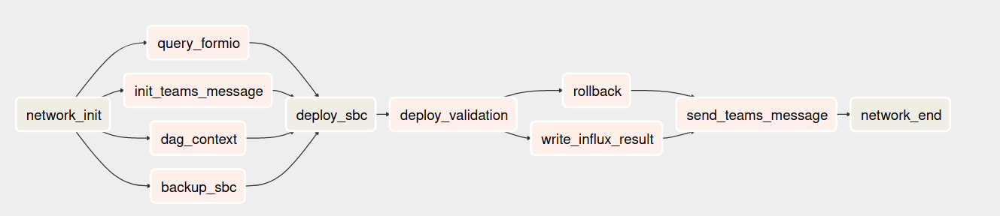

# network-automation


Repositorio con ejemplos de automatización orientados a infraestructura de telecomunicaciones. Puntualmente, dos ejemplos de telemetría y uno de automatización a través de workflow engine que utiliza inventario dinámico de ansible para aprovisionarse de los datos necesarios para ejecutarse.


## Telemetry ICMP

```bash
(network-automation) jgonzalez@turing:~/dev/network-automation/telemetry/ansible/sbc(master)$ ansible-playbook -i  hosts icmp.yml
```

## Telemetry SBC

```bash
(network-automation) jgonzalez@turing:~/dev/network-automation/telemetry/ansible/sbc(master)$ ansible-playbook -i inventory sbc.yml
```

## Automation SBC
Flujo para desarrollo




Ver README.md de automation
