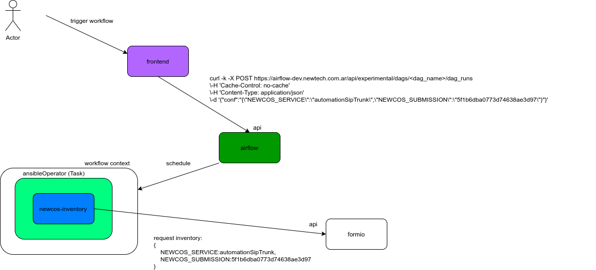
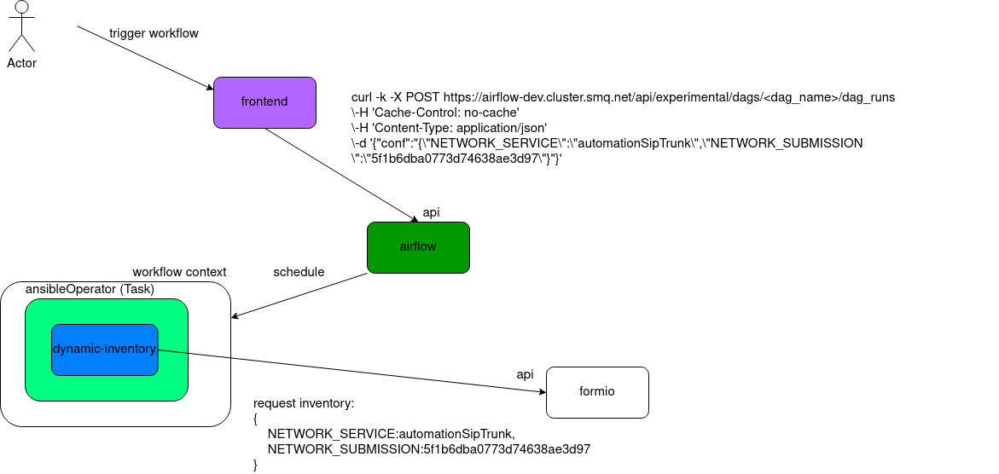

# dynamic-inventory


Repositorio con script de inventario dinámico para Ansible. Este script se integra con base de datos noSQL form.io (mongo). 

La funcionalidad de este script es la de renderizar el inventario con todas las variables que necesita un playbook para ejecutarse en runtime. Es decir, si el inventario de la tarea o el host sobre el que tiene que interactuar ansible ha sufrido alguna modificación, al momento de correr el playbook, consultará los nuevos datos.

**Tabla de contenido**

- [Comenzando](#comenzando)
- [Instrucciones de uso](#instrucciones-de-uso)
- [Desarrollo](#desarrollo)
  - [Integracion Airflow](#integracion-airflow)
  - [Integracion Standalone](#integracion-standalone)
- [Despliegue](#despliegue)
  - [Building](#building)
  - [Despliegue docker container](#despliegue-docker-container)
  - [Despliegue docker-compose](#despliegue-docker-compose)

## Comenzando

Clonar repositorio y (opcional) crear un virtualenv python para el manejo de depenncias

```bash
$ git clone git@github.com:joagonzalez/network-automation.git
$ mkproject network-automation
$ workon network-automation
$ pip install -r requirements.txt
```

## Instrucciones de uso
El script utilizará como input variables de ambiente del contexto de ejecución. Las variables soportadas son:

- **NETWORK_SERVICE**: Recurso de formio al cual debe consultar el inventario (task o host)
- **NETWORK_SUBMISSION**: Submission del recurso definido en NETWORK_SERVICE que debe consultar el inventario. Si no está definida, el inventario traerá todas las submissions dentro del recurso

Ejemplo utilizando NETWORK_SERVICE como variable de ambiente:

```bash
export NETWORK_SERVICE='automationSipTrunk'
(inventory) ~/inventory/src(master)$ python dynamic-inventory.py --list
```

Resultado:

```bash
{"_meta": {"hostvars": {"13.66.159.172": {"hostname": "13.66.159.172", "role": "sbc", "username": "sbcadmin", "password": "Argentina2020#", "connectionMethod": "telnet", "sip_trunk_ip_address": "10.10.10.2", "port": "5068", "last_backup": null, "backup": ""}}}, "sbc": {"hosts": ["13.66.159.172"], "vars": {}}}
```

Ejemplo utilizando tanto NETWORK_SERVICE como NETWORK_SUBMISSION:

```bash
export NETWORK_SERVICE='automationSipTrunk'
export NETWORK_SUBMISSION='5f1b6dba0773d74638ae3d97'
(inventory) ~/inventory/src(master)$ python dynamic-inventory.py --list
```

Resultado

```bash
{"_meta": {"hostvars": {"192.168.0.20": {"hostname": "192.168.0.20", "role": "sbc", "username": "sbcadmin", "password": "Argentina2020#", "connectionMethod": "telnet", "sip_trunk_ip_address": "20.20.20.2", "port": "5060", "last_backup": null, "backup": ""}, "13.66.159.172": {"hostname": "13.66.159.172", "role": "sbc", "username": "sbcadmin", "password": "Argentina2020#", "connectionMethod": "telnet", "sip_trunk_ip_address": "10.10.10.2", "port": "5068", "last_backup": null, "backup": ""}}}, "sbc": {"hosts": ["192.168.0.20", "13.66.159.172"], "vars": {}}}
```

Ejemplo ejecutando un playbook junto con script de inventario dinámico filtrado:

```bash
export ANSIBLE_STDOUT_CALLBACK=debug
(inventory) ~/inventory/src(master)$ ansible-playbook -i dynamic-inventory.py utilities/playbooks/sbc.yaml
```

Resultado:

```bash
PLAY [RUN COMMAND AND PRINT TO TERMINAL WINDOW] **************************************************************************

TASK [debug] *************************************************************************************************************
ok: [192.168.0.20] => {
    "msg": "SIP Trunk: 20.20.20.2 \n Port: 5060"
}
ok: [13.66.159.172] => {
    "msg": "SIP Trunk: 10.10.10.2 \n Port: 5068"
}
```

## Desarrollo

### Integracion Airflow
Esquema de integración de dynamic-inventory desde workflow de airflow considerando los datos que deben pasarse a través del api.

Todos los ejemplos toman el DAG `utilities/dags/network_dag.py` que implementa una integración *end-to-end*.




Ejemplo ejecución de workflow a través de api airflow con parametrización en objeto conf.
```
curl -k -X POST https://airflow-dev.cluster.smq.net/api/experimental/dags/deploy_sbc/dag_runs \-H 'Cache-Control: no-cache' \-H 'Content-Type: application/json' \-d '{"conf":"{\"NETWORK_SERVICE\":\"automationSipTrunk\",\"NETWORK_SUBMISSION\":\"5f1b6dba0773d74638ae3d97\"}"}'
```

Snippet de código para leer objeto **conf** con **context que se obtiene desde el llamado por api.
```Python
def context_data(**context):
    """
    Print the payload passed to the DagRun conf attribute.
    :param context: The execution context
    :type context: dict
    """
    print("Remotely received value of {}".format(str(context["dag_run"].conf)))

context_data = PythonOperator(task_id='dag_context', python_callable=context_data, dag=dag)
```

Debug de la tarea que ejecuta playbook de ansible con dynamic-inventory en airflow:
```
[2020-07-25 19:34:46,010] {{python_operator.py:105}} DEBUG - Exporting the following env vars:
AIRFLOW_CTX_DAG_OWNER=Airflow
AIRFLOW_CTX_DAG_ID=deploy_sbc
AIRFLOW_CTX_TASK_ID=dag_context
AIRFLOW_CTX_EXECUTION_DATE=2020-07-25T19:34:18+00:00
AIRFLOW_CTX_DAG_RUN_ID=manual__2020-07-25T19:34:18+00:00
[2020-07-25 19:34:46,011] {{logging_mixin.py:112}} INFO - Remotely received value of {'NETWORK_SERVICE': 'automationSipTrunk', 'NETWORK_SUBMISSION': '5f1b6dba0773d74638ae3d97'}
[2020-07-25 19:34:46,011] {{python_operator.py:114}} INFO - Done. Returned value was: None
```

Ejecutar workflow seteando distintas variables de ambiente para filtrar el inventario:
```
curl -k -X POST https://airflow-dev.cluster.smq.net/api/experimental/dags/automation_dag/dag_runs \-H 'Cache-Control: no-cache' \-H 'Content-Type: application/json' \-d '{"conf":"{\"NETWORK_SERVICE\":\"automationSipTrunk\",\"NETWORK_SUBMISSION\":\"5f1b6dba0773d74638ae3d97\"}"}'
curl -k -X POST https://airflow-dev.cluster.smq.net/api/experimental/dags/automation_dag/dag_runs \-H 'Cache-Control: no-cache' \-H 'Content-Type: application/json' \-d '{"conf":"{\"NETWORK_SERVICE\":\"automationSipTrunk\",\"NETWORK_SUBMISSION\":\"5f1ba0fb0773d710a5ae3da1\"}"}'
```

Si bien el camino a seguir es crear un operador que nos permita ejecutar un playbook que tome parametros de una abstracción, por el momento se utiliza un BashOperator. El BashOperator recibe el parametro `bash_command` que se construye de manera tal que corra el playbook con el inventario dinamico tomando todos los datos de un shared folder en el cluster. Por otro lado, recibe un parametro `env` donde recibe un diccionario que convertirá en variables de ambiente (cada key en el dict será el nombre de la env var y cada value será el valor seteado en el contexto de ejecución del operador).
```Python
environment_ansible = {
                        'NETWORK_SERVICE': '{{ dag_run.conf["NETWORK_SERVICE"] if dag_run else "" }}',
                        'NETWORK_SUBMISSION': '{{ dag_run.conf["NETWORK_SUBMISSION"] if dag_run else "" }}'
                      }

templated_command =  'cd ' + PLAYBOOKS + \
        ' && ansible-playbook -i ' + SCRIPTS + '/dynamic-inventory/src/dynamic-inventory.py ' + PLAYBOOKS + \
        '/' + ANSIBLE_PLAYBOOK + ' && printenv'

ansible_playbook_sbc = BashOperator(task_id='playbook_sbc',bash_command=templated_command, env=environment_ansible, dag=dag,)

```

Task logs
```
[2020-07-27 19:24:04,056] {{bash_operator.py:115}} INFO - Running command: cd /usr/local/airflow/playbooks && ansible-playbook -i /usr/local/airflow/scripts/dynamic-inventory/src/dynamic-inventory.py /usr/local/airflow/playbooks/sbc_audiocodes_telnet.yaml && printenv
```

Consideraciones  a tener en cuenta para realizar tareas de configuración sobre dispositivos AudioCodes sobre telnet. El `enter` se obtiene por cli con la combinación `\r\n\r\n`. Esta misma debe definirse en `newline_sequence` de forma explícita en los templates de jinja2 para interactuar sin inconvenientes con el dispositivo.

Ejemplo:
```jinja
#jinja2: newline_sequence:'\r\n\r\n'
configure voip
proxy-set {{proxy_set}}
proxy-redundancy-mode homing
srd-name {{srd_name}}
sbcipv4-sip-int-name {{sip_interface}}
proxy-name {{proxy_name}}
activate
exit
```

Ejemplo de playbook que utiliza jinja2 para configurar SBC AudioCodes desde airflow:

```yaml
# jinja templates
- name: mop template
  set_fact:
    jinja_template: "{{lookup('template', 'templates/sip.j2')}}"

- debug:
    msg: "{{ jinja_template }}"
  
- debug:
    msg: " proxy set: {{proxy_set}} \
          \n srd name: {{srd_name}} \
          \n sip interface: {{sip_interface}} \
          \n proxy name: {{proxy_name}}"

- name: Telnet a SBCs
  telnet:
    timeout: 30
    user: "sbcadmin\r"
    password: "Argentina2020#\r"
    login_prompt: "Username: "
    password_prompt: "Password: "
    prompts:
      - "M800B>|M800B#|Mediant VE SBC#|Mediant VE SBC(config-voip)#|Mediant VE SBC(proxy-set-[0-9]+)#|[)#] "
    command:
      - "{{jinja_template}}"
  register: sipOutput

- debug:
    msg: "{{sipOutput}}"
```

### Integracion Standalone
Flujo de la integración de dynamic-inventory utilizado de manera directa con ansible. Los ejemplos de uso se muestran en la sección correspondiente.




### Despliegue
Solo debe clonarse el repositorio e instalar los requerimientos correspondientes como se indica en la sección `Comenzando`.

#### Building
#### Despliegue docker container
#### Despliegue docker-compose
